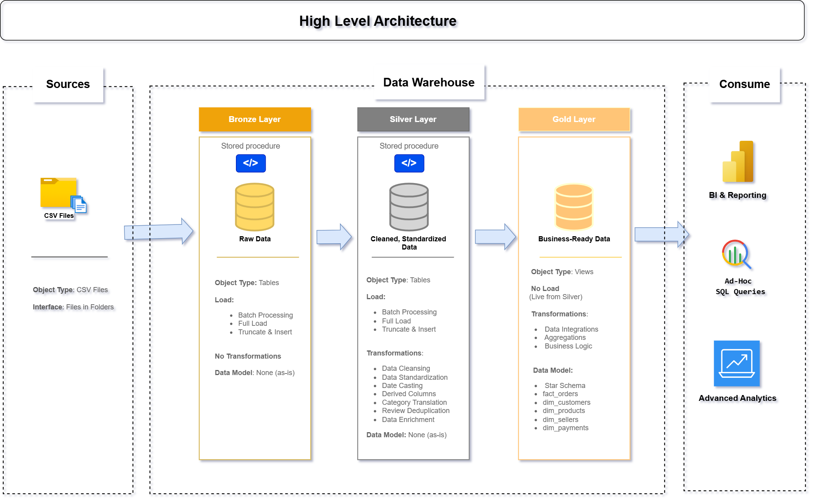

# 🏪 Olist E-Commerce Data Warehouse

## 📌 Overview

An end-to-end **SQL Data Warehouse project** built using the **Olist Brazilian E-Commerce Dataset**, containing over **100,000 orders** across multiple Brazilian marketplaces.

The project implements a **Medallion Architecture (Bronze → Silver → Gold)** to transform raw transactional data into a structured, analytics-ready **Star Schema** for reporting and business intelligence.

---

## ✨ Key Highlights

- End-to-end data warehouse design
- Medallion architecture implementation (Bronze → Silver → Gold)
- SQL-based ETL pipeline using stored procedures
- Star schema dimensional modeling
- Data quality validation framework
- Real-world dataset (100k+ records)

---

## 🏗️ Architecture



### 🟤 Bronze Layer
- Raw ingestion of 8 CSV files into SQL Server
- Data loaded using `BULK INSERT`
- No transformations applied

### 🥈 Silver Layer
- Data cleaning and standardization
- Duplicate removal
- Category translation (Portuguese → English)
- Derived columns (delivery_days, late_flag)
- Data enrichment

### 🥇 Gold Layer
- Business-ready Star Schema
- Fact and dimension tables created using SQL views
- Optimized for analytics and reporting

---

## 📂 Repository Structure

```text
olist-ecommerce-data-warehouse/
│
├── data_quality/
│   ├── quality_checks_gold.sql
│   └── quality_checks_silver.sql
│
├── docs/
│   ├── architecture.png
│   └── data_catalog.md
│
├── scripts/
│   ├── bronze/
│   │   ├── ddl_bronze.sql
│   │   └── load_bronze.sql
│   │
│   ├── silver/
│   │   ├── ddl_silver.sql
│   │   ├── explore_bronze.sql
│   │   └── load_silver.sql
│   │
│   ├── gold/
│   │   └── ddl_gold.sql
│   │
│   └── init_database.sql
│
└── README.md
```

---

## 📊 Dataset

**Source:** [Olist Brazilian E-Commerce Dataset](https://www.kaggle.com/datasets/olistbr/brazilian-ecommerce)

The dataset includes:

| Dataset | Description |
|----------|-------------|
| Customers | Customer information and location |
| Orders | Order lifecycle and timestamps |
| Order Items | Products purchased in each order |
| Payments | Payment methods and values |
| Reviews | Customer ratings and comments |
| Products | Product details and categories |
| Sellers | Seller information |
| Category Translation | Portuguese-to-English mapping |

---

## 🔄 ETL Pipeline

### 🟤 Bronze Layer
Raw data ingestion from CSV files into SQL Server using stored procedures and `BULK INSERT`.

### 🥈 Silver Layer
Transformations applied:
- Data cleaning
- Standardization
- Deduplication
- Category mapping
- Derived metrics (delivery time, delay flags)

### 🥇 Gold Layer
Star schema creation:
- `fact_orders`
- `dim_customers`
- `dim_products`
- `dim_sellers`
- `dim_payments`

---

## ✅ Data Quality

Validation checks include:
- Duplicate detection
- Null value checks
- Primary key constraints
- Referential integrity
- Business rule validation

All checks are located in the `data_quality/` folder.

---

## ▶️ How to Run

### Prerequisites
- SQL Server Express
- SQL Server Management Studio (SSMS)

### Steps

1. Download dataset from Kaggle  
2. Update file paths in `load_bronze.sql`  
3. Run scripts in order:

```text
scripts/init_database.sql
scripts/bronze/ddl_bronze.sql
scripts/bronze/load_bronze.sql
scripts/silver/ddl_silver.sql
scripts/silver/load_silver.sql
scripts/gold/ddl_gold.sql
```

4. Run validation scripts in `data_quality/`

---

## 🛠️ Technologies Used

| Tool | Purpose |
|------|--------|
| SQL Server Express | Database engine |
| SSMS | SQL development |
| SQL | ETL + modeling |
| Draw.io | Architecture design |
| GitHub | Version control |

---
